<div align="center">
  
  
  # Global Horizon Bank - Enterprise Data Warehouse
  
  **An End-to-End Data Architecture Project from OLTP to OLAP**

  [](https://www.python.org)
  [](https://www.microsoft.com/sql-server/)
  [](https://streamlit.io/)
  [](https://pandas.pydata.org/)
  [](https://opensource.org/licenses/MIT)

  <p align="center">
    <b>Transforming transactional bottlenecks into analytical powerhouses.</b>
  </p>
</div>

---

## 📖 Project Overview

This repository contains the complete architecture and implementation of a data system for **Global Horizon Bank**. Following industry best practices, the project transitions from a highly normalized Transactional Database (OLTP) to a high-performance dimensional Data Warehouse (OLAP), capable of answering complex business questions at scale.

### 🌐 Public Streamlit Dashboard

The deployed public app is available at: **[https://global-horizon-bank.streamlit.app/](https://global-horizon-bank.streamlit.app/)**

---

## 🏗️ Architecture Pipeline



---

## 🗂️ Repository Structure

The project is structured according to GitHub standard practices for data engineering projects:

```bash
📦 DWH-Project
 ┣ 📂 data
 ┃ ┣ 📂 raw/          # Generated synthetic transactional data (CSV)
 ┃ ┗ 📂 processed/    # Output analytical data (if applicable)
 ┣ 📂 sql
 ┃ ┣ 📂 oltp/         # Transactional database schema & DML (Phases 2-4)
 ┃ ┣ 📂 etl/          # Extraction, Transformation, Load scripts (Phase 5)
 ┃ ┗ 📂 olap/         # Data Warehouse Star Schema & Analytics (Phases 6-9)
 ┣ 📂 src/            # Python scripts for data generation & pipelines
 ┣ 📂 diagrams/       # ERDs and architecture diagrams (Draw.io, SVG, PNG)
 ┣ 📂 dashboard/      # Streamlit analytical dashboard app
 ┣ 📂 docs/           # Comprehensive implementation guides and phase documentation
 ┃ ┣ 📜 phases.md                       # The 9 Phases Detailed
 ┃ ┣ 📜 sql_implementation_guide.md     # SQL Architecture & Tuning
 ┃ ┗ 📜 streamlit_dashboard_guide.md    # Dashboard & Visualizations
 ┗ 📜 README.md       # Project overview
```

---

## 🚀 The 9 Phases of Implementation

### 1️⃣ Business Understanding
Defined the banking domain, identified stakeholders, and established KPIs (Total Volume, Active Accounts, Loan Default Rates).

### 2️⃣ OLTP Database Design
Designed a **3NF Relational Database** in SQL Server to handle daily banking operations. Includes tables for `Customers`, `Accounts`, `Transactions`, `Loans`, `Branches`, and `Employees`.
*See `diagrams/oltp_erd.drawio`*

### 3️⃣ OLTP Workload Simulation
Generated synthetic "Big Data" using Python (`Faker` & `Pandas`), creating 100,000+ transactions across 10,000+ customers to stress-test the schema.
*Run `python src/data_generation.py`*

### 4️⃣ OLTP Limitations Analysis
Demonstrated why OLTP is poorly suited for analytics through complex T-SQL queries showing high I/O costs and locking issues.
*See `sql/oltp/03_queries_oltp.sql`*

### 5️⃣ ETL Design
Built T-SQL Stored Procedures to cleanly extract data from the OLTP system, transform datatypes/structures, and load into the Data Warehouse.
*See `sql/etl/01_etl_procedures.sql`*

### 6️⃣ Data Warehouse Design
Architected an optimized **Star Schema** with `Fact_Transaction` and dimensions for Date, Branch, Customer, and Account.
*See `diagrams/olap_erd.drawio`*

### 7️⃣ Advanced Modeling Concepts
Implemented **Surrogate Keys** and **Slowly Changing Dimensions (SCD Type 2)** for tracking customer relocations geographically over time without losing historical transaction accuracy.
*See `sql/olap/02_advanced_modeling.sql`*

### 8️⃣ Performance & Scalability
Configured **Table Partitioning** by Year on the Fact table and implemented **Clustered Columnstore Indexes** to handle massive data volumes efficiently.
*See `sql/olap/03_indexing_partitioning.sql`*

### 9️⃣ Analytical Queries, Reporting & Recommendations
Created an interactive **Streamlit Dashboard** that combines KPI monitoring, behavioral analysis, and rule-based business recommendations for faster decision-making.
*See `sql/olap/04_analytical_queries.sql` and `dashboard/app.py`*

#### Dashboard Highlights
- Multi-dimensional filtering (date, transaction type, branch, state, age group, account type/status, amount range)
- Analysis controls for **Metric Mode** (`Amount` vs `Transaction Count`), **Time Grain** (`Day/Week/Month/Quarter`), and **Top N branches**
- Period-over-period KPI deltas for transactions, volume, average ticket, active accounts, and weekend share
- Dedicated **Business Recommendations** tab with prioritized, explainable actions
- Data Explorer with downloadable filtered dataset

#### Business Recommendations (Examples)
- Flag branch concentration risk when one branch dominates selected activity
- Recommend weekend staffing/liquidity adjustments when weekend share is elevated
- Detect momentum changes through previous-period comparison and suggest retention or scaling actions
- Highlight premium-segment opportunities when selected average ticket outperforms baseline
- Suggest transaction-mix diversification when one behavior dominates

---

## 🛠️ How to Run Locally

### 1. Generate the Data
```bash
pip install pandas faker diagrams
python src/data_generation.py
```

### 2. Setup SQL Server Databases & Run ETL
We have provided an automated script that connects to your local SQL Server (default port `21433` with user `sa` and password `MyStrongPass123!`), initializes the OLTP and Data Warehouse schemas, uploads the generated big data, and runs the ETL stored procedures automatically:
```bash
python src/setup_sqlserver.py
```
*(Alternatively, you can manually execute the `.sql` scripts in SSMS in the following order: `oltp/01_ddl_oltp.sql`, `olap/01_ddl_star_schema.sql`, `etl/01_etl_procedures.sql`)*

### 3. Run the Analytics Dashboard (Locally)
```bash
pip install -r requirements.txt
streamlit run dashboard/app.py
```

### 4. Run via Docker 🐳
If you prefer to run the project via containers without installing Python dependencies locally:
```bash
docker-compose up --build
```
This will containerize the Streamlit dashboard and expose it at `http://localhost:8501`.

### 5. Recent Project Updates
- Upgraded dashboard interactivity with metric-mode switching, time-grain control, and configurable Top-N branch analysis
- Added period-over-period KPI delta tracking across core executive metrics
- Introduced a dedicated business recommendation layer with transparent, rule-based insights
- Updated pipeline architecture visual to reflect the **Dashboard + Recommendations** decision-support output

---

<div align="center">
  <i>Developed as part of the Data Engineering Diploma</i>
</div>
