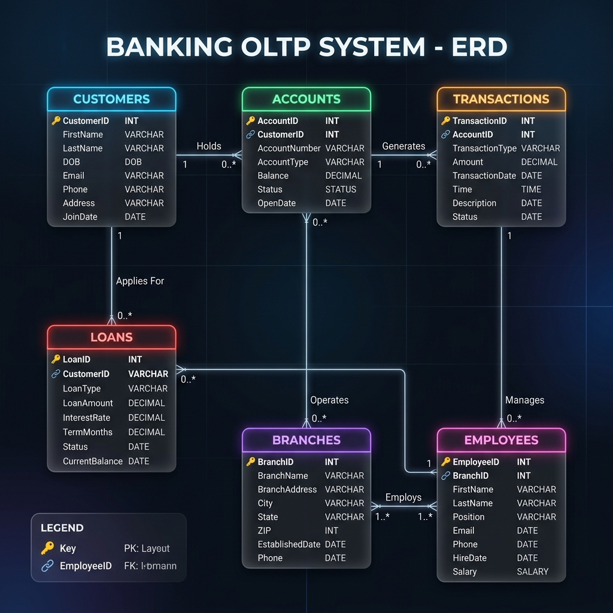
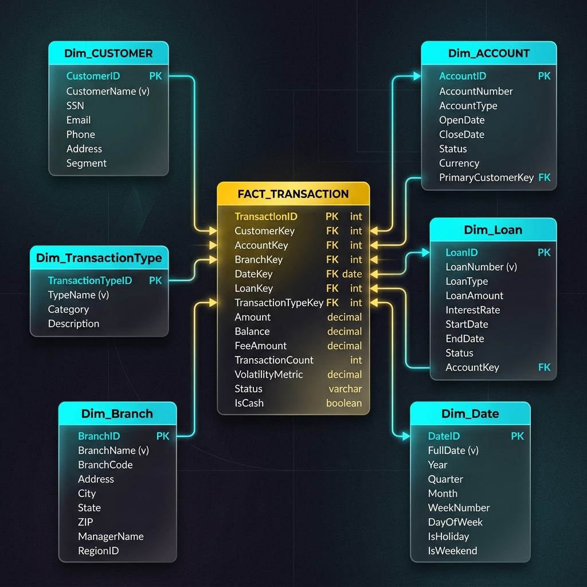

<div align="center">
  

  # Global Horizon Bank - Enterprise Data Warehouse

  **End-to-End Banking Data Intelligence Architecture**

  [](https://www.python.org)
  [](https://streamlit.io/)
  [](https://pandas.pydata.org/)
  [](https://plotly.com/)

  <p align="center">
    <b>Transforming transactional data into high-impact business decisions for the Egyptian market.</b>
  </p>

  [**🚀 View Live Dashboard**](https://global-horizon-bank-dwh-project.streamlit.app/)
</div>

---

## 🏗️ Modern Architecture Pipeline


---

## 📊 Analytics & Insights Dashboard
The **Global Horizon Bank Dashboard** is a state-of-the-art analytical tool designed for executive decision-making.

### Key Features:
- **Executive KPIs**: Real-time monitoring of Transactions, Volume, Average Ticket, Active Accounts, and Weekend Share with period-over-period deltas.
- **Localized Context**: Specifically tailored for the Egyptian banking sector, including **Governorate-level analysis** (Cairo, Giza, Alexandria, Dakahlia, etc.).
- **Loan Portfolio Analytics**: Dedicated module for tracking loan types, status distribution, and portfolio age.
- **Intelligent Recommendations**: A rule-based engine that identifies risks (branch concentration, momentum shifts) and premium growth opportunities.
- **Dynamic Controls**: Switch between **Volume ($)** and **Transaction Count**, adjust time grains (**Year/Quarter/Month**), and filter by demographics.

---

## 🗂️ Data Models
### OLTP System (Transactional)
Designed for high-integrity daily operations.


### OLAP Data Warehouse (Analytical)
Optimized Star Schema for high-performance complex queries.


---

## 🛠️ How to Run Locally

1. **Prerequisites**: Ensure you have Python 3.11+ installed.
2. **Installation**:
   ```bash
   pip install -r requirements.txt
   ```
3. **Data Preparation**: (Optional) Re-generate the synthetic Egypt-market data.
   ```bash
   python src/data_generation.py
   ```
4. **Execution**:
   ```bash
   streamlit run dashboard/app.py
   ```
5. **Access**: Open your browser at `http://localhost:8501`.

---

## ☁️ Deployment Guide

### Streamlit Cloud (Recommended)
1. Push this repository to your **GitHub**.
2. Visit [Streamlit Cloud](https://share.streamlit.io/) and connect your account.
3. Select this repository and the `dashboard/app.py` as the main file.
4. **Secrets Management**: If using the SQL Server fallback, add your credentials (HOST, USER, PASS, etc.) to the Streamlit Cloud "Secrets" panel.
5. **Auto-Loading**: The app is configured to automatically detect and load the CSV files bundled in the repository, making it plug-and-play.

### Docker Deployment
```bash
docker-compose up --build
```

---

<div align="center">
  <i>Developed by Antigravity AI for the Data Engineering Diploma</i>
</div>
